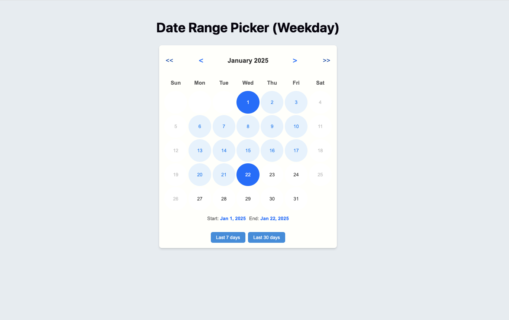

# Weekday Date Range Picker

A customizable and interactive **Weekday Date Range Picker** built using **React**, **TypeScript**, and **Vite**. This component allows users to select a date range excluding weekends and integrates predefined date ranges with callback functionality.

## Project Features

- **React** with **TypeScript** for type-safe development
- **Vite** for fast builds and hot module replacement (HMR)
- Predefined date range options
- Disables weekend dates from selection
- Highlights selected date range with start and end indicators

## Getting Started

## Screenshots

  
_Example showing the calendar interface with selectable dates and predefined ranges._
### Installation

1. Clone the repository:
   ```bash
   git clone https://github.com/your-username/weekday-date-range-picker.git
   cd weekday-date-range-picker
   ```

2. Install dependencies:
   ```bash
   npm install
   # or
   yarn install
   ```

### Running the Application

1. Start the development server:
   ```bash
   npm run dev
   # or
   yarn dev
   ```

2. Open your browser and navigate to:
   ```
   http://localhost:5173/
   ```

Vite provides fast HMR, ensuring a smooth development experience.

## Usage

Import and use the `WeekdayDateRangePicker` component in your application:

```jsx
import React from 'react';
import WeekdayDateRangePicker from './components/WeekdayDateRangePicker/WeekdayDateRangePicker';

function App() {
  const handleRangeChange = (range, weekends) => {
    console.log('Selected Range:', range);
    console.log('Excluded Weekends:', weekends);
  };

  return (
    <div className="App">
      <h1>Weekday Date Range Picker</h1>
      <WeekdayDateRangePicker onRangeChange={handleRangeChange} />
    </div>
  );
}

export default App;
```

## Building for Production

To build the project for production:
```bash
npm run build
# or
yarn build
```
The built files will be available in the `dist` directory.

## ESLint Configuration (Optional Enhancements)

### Type-Aware Linting

To enable type-aware lint rules:

1. Update the top-level `parserOptions` in your ESLint configuration:
   ```js
   export default tseslint.config({
     languageOptions: {
       parserOptions: {
         project: ['./tsconfig.node.json', './tsconfig.app.json'],
         tsconfigRootDir: import.meta.dirname,
       },
     },
   });
   ```

2. Use stricter configurations:
   - Replace `tseslint.configs.recommended` with `tseslint.configs.recommendedTypeChecked` or `tseslint.configs.strictTypeChecked`.

3. Optionally add stylistic rules:
   ```js
   ...tseslint.configs.stylisticTypeChecked
   ```

4. Install and configure `eslint-plugin-react`:
   ```js
   import react from 'eslint-plugin-react';

   export default tseslint.config({
     settings: { react: { version: '18.3' } },
     plugins: { react },
     rules: {
       ...react.configs.recommended.rules,
       ...react.configs['jsx-runtime'].rules,
     },
   });
   ```

## License

This project is open-source and available under the [MIT License](./LICENSE).

